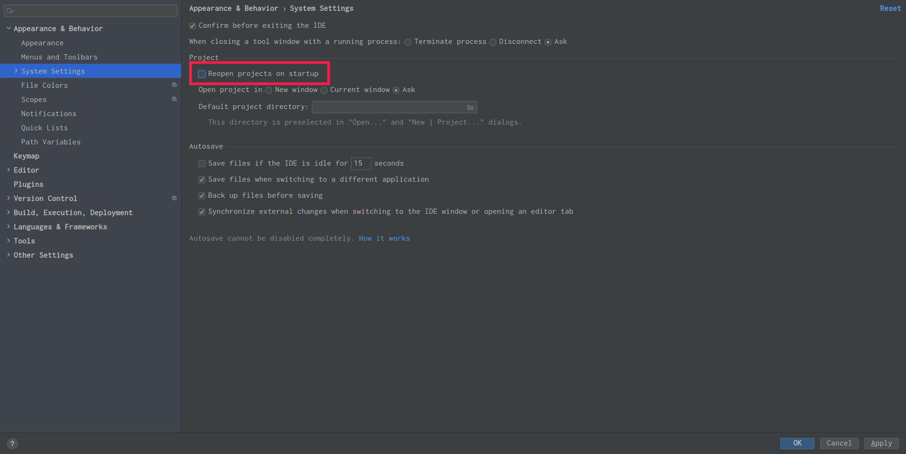

###  IDEA 配置

#### 好用的插件
- MyBatisX : 方便 Mapper 接口与 Xml 文件之间的导航。
- Maven Helper: Maven 依赖查看，方便解决依赖冲突
- Alibaba Java Coding Guidelines 阿里巴巴Java开发规范
- Lombok 代码简化工具
- Key Promoter X快捷键学习工具
- ReadHub 每天高效浏览行业资讯
- CodeGlance 代码地图插件
- RestfulTool 一套 Restful 服务开发辅助工具集，能快速通过请求url 找到Controller


#### 1. 字体修改


#### 2. 设置每次启动idea不自动打开项目




#### 3. 配置文件头注释模板


自定义一个注释模板

```
/** 
 * @Description: TODO(这里用一句话描述这个类的作用) 
 * @Author ${USER}
 * @Date ${DATE} ${TIME} 
 */
```


修改Class中的默认名

```
这里改为你定义的名称
#parse("My File Header.java")
```


记得保存


#### 4. 重用运行配置

- 添加tomcat 配置，并保存

  

- 再项目路径 .idea/runConfigurations中找到运行的配置，保存起来
- 再新的项目中，重新包这些运行配置放到  .idea/runConfigurations中，重启IDEA，就可以重用配置