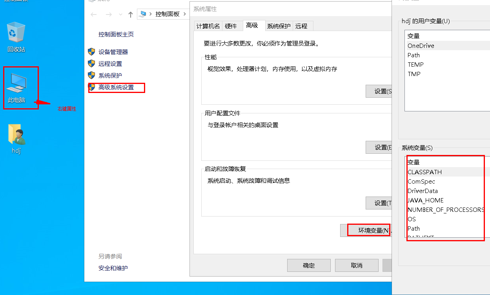

### 一、Java 开发环境配置


#### 1. 下载JDK 
- [oracle Jdk](https://www.oracle.com/java/technologies/javase-downloads.html)
- [oracle openJDK](https://jdk.java.net/)
- [amazon openJdk发行版](https://aws.amazon.com/cn/corretto/)
- [alibaba openJdk发行版](http://dragonwell-jdk.io/)


#### 2. Window 系统

- 进入环境配置



- 配置JAVA_HOME

```
D:\software\openjdk\java-se-8u41-ri
```

- 配置 CLASSPATH

```
.;%JAVA_HOME%\lib;%JAVA_HOME%\lib\tools.jar
```

- 添加到path 中

```
%JAVA_HOME%\bin;%JAVA_HOME%\jre\bin
```

#### 3. Linux 系统
```
vim /etc/profile

export JAVA_HOME=jdk路径
export JRE_HOME=jdk路径/jre
export CLASSPATH=.:$JAVA_HOME/lib:$JRE_HOME/lib:$CLASSPATH
export PATH=$JAVA_HOME/bin:$JRE_HOME/bin:$PATH


配置生效
source /etc/profile

#查看java版本
java -version
```

### 二、 Java 多版本管理
- 可以选择的工具
    - [jenv](https://github.com/jenv/jenv)
    - [jabba](https://github.com/shyiko/jabba)

### 三、Maven 管理工具配置
- 下载
    - https://maven.apache.org/download.cgi
    
- maven 仓库配置 setting.xml文件中
```
<mirror>  
  <id>alimaven</id>  
  <name>aliyun maven</name>  
  <url>http://maven.aliyun.com/nexus/content/groups/public/</url>;  
  <mirrorOf>central</mirrorOf>          
</mirror>
```